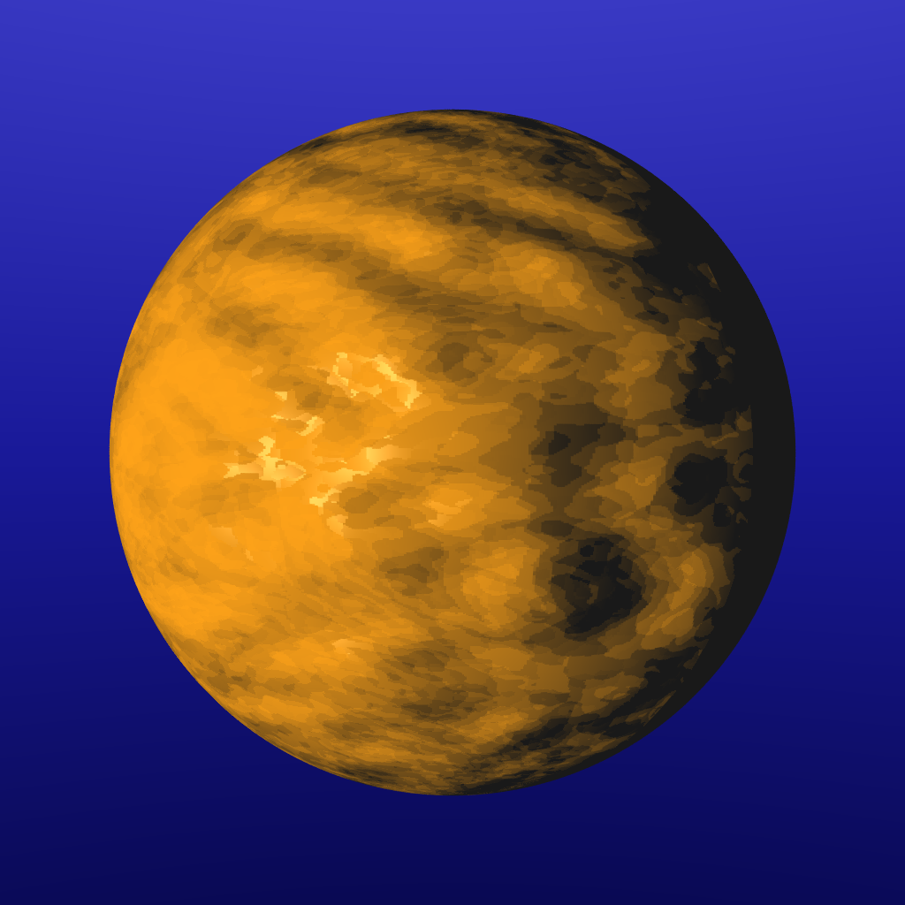
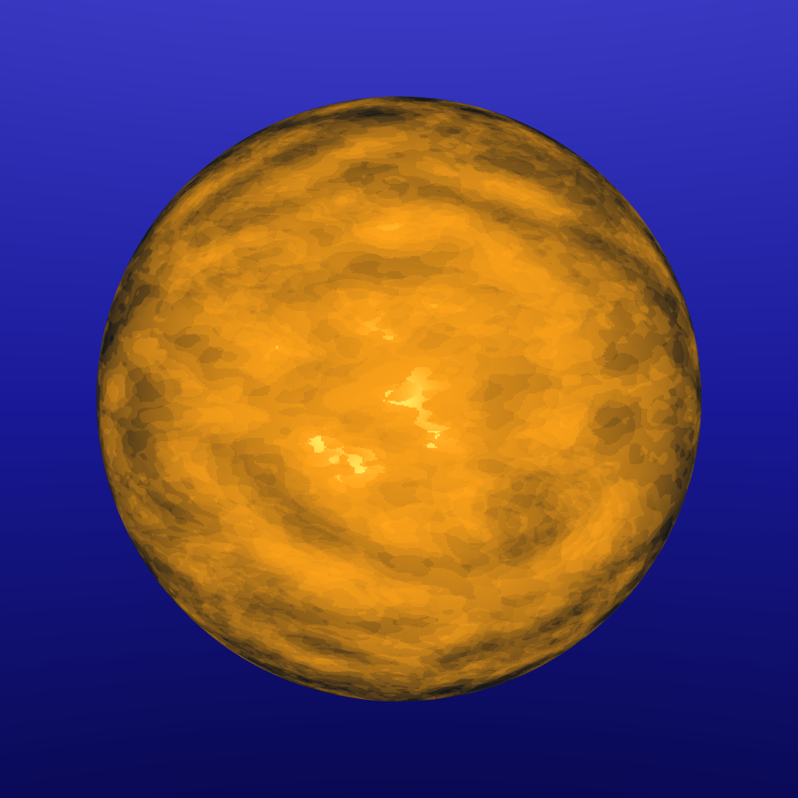

This is a summary and showcase of the features I implemented for my final Introduction to Computer Graphics ray tracer project. Ray tracing is a method of rendering a digital image by sending rays of light through each pixel and simulating how they interact with a scene. As part of my project, I implemented 10 objectives (including rendering of a final scene designed by me) plus some bonus features.

## Reflection

When a ray intersects with a reflective surface, we bounce the ray off such that the incident angle to the normal is equal to the reflected angle.

TODO coloured reflection

## Refraction

Refraction is more interesting since it has both a reflected and transmitted component to it. The degree to which light is slowed down when traveling through a material is its index of refraction. The angle that a ray is transmitted at through the material is related to the difference in the index of refraction between it and the surrounding air. We can use something called the Schlick approximation to estimate what proportion of light is reflected vs. transmitted when a ray intersects a refractive material. In general, the shallower the angle between the ray and the surface, the more it's reflected. The two images show refraction with index 1.01 and 1.33, respectively.

## Glossy reflection

No real-world material is perfectly smooth and reflective like we simulated above. Instead, tiny imperfections in an object's surface cause light rays to bounce in slightly different directions from the ideal. By slightly perturbing reflected rays about the exact angle of reflectance, we get a glossy effect. Changing the degree by which rays are perturbed affects how smooth the object looks.

TODO glossy reflection comparison

## Incoherent (glossy) transmission

Similarly to glossy reflection, we can slightly perturb our rays when calculating refraction to give a glossy appearance. A slight difference is that we instead change the normal that we use to find the angles of the reflected and transmitted rays.

TODO glossy refraction comparision

## Bump mapping

We use a process called UV mapping to convert any 3D point on an object to a coordinate in 2D space between (0,0) and (1,1). When a ray intersects with an object, we can use this to look up values in an image (raster) file that contains a height map (kind of like a topological map). We use derivatives of the height map to find the slope in the u and v directions and use that to displace the normal of the object. This lets us make objects that appear to have bumps or grooves in them.

TODO get bigger images

## Texture mapping

We can reuse the UV mapping strategy above to look up the colour of an object at any given point. This lets us "wrap" images around our 3D models, adding lots of detail and visual appeal for relatively low cost.

## Soft shadows

Up until now, all of our objects have cast hard, precise, and pretty unrealistic shadows. This is because our light sources so far have always been single points. To add softer, more realistic shadows, we can give our lights some radius and use a stochastic sampling technique (similar to glossy reflection) to randomly sample shadow rays across the surface of the light. Objects farther away from light sources then cast harder shadows than those close to light sources. In the below image, we can see that the umbra is largest relative to the penumbra in the rectangle closest to the light.

## Adaptive antialiasing

Sending out one ray per pixel renders images with very hard edges and jagged lines (called aliasing). We can mitigate this by sending out multiple rays per pixel in slightly different directions and averaging the results. However, this is pretty expensive and there is a lot of time wasted on regions of the scene where not a lot is going on. Many scenes have decent amounts of flat walls or empty space that doesn't result in aliasing. What we can instead to is use a technique to identify which parts need to be supersamples. My impementation does a second pass over the image and find pixels that vary in colour from at least one neighbour by some minimum threshold. These pixels are then supersampled as normal.

## Grid spatial partitioning

Every time we send out a ray to collide with our scene, we run through the entire hierarchy of nodes and test each individually if our ray intersects with it. For scenes with a large number of objects that are widely spaced out, this is a very inefficient strategy. What we can instead do is divide the scene up into equal-sized cells. For each cell, we store which objects are at least partially inside it. This lets us find which cells our ray will pass through, which is relatively cheap to do, and only intersect with objects contained in those cells. Rendering the below array of reflective spheres was over 5x faster with this strategy (on my 8 core laptop).

|             | Metric       | Time (s)
| ----------- | ------------ | -----------:
|Without grid | Real time    | 406
|             | User time    | 3179
|With grid    | Real time    | 71
|             | User time    | 558

## Final scene

Below is my final scene. It uses refraction, reflection, texture mapping, adaptive antialiasing, and phong shading. The scene features some wooden puppets being mischievous inside of their box. The mug, pouring water, and puppet meshes were available free online (with the puppets posed by me via Blender).

## Bonus objective: Phong shading

We can give meshes a much smoother appearance without adding exponentially more polygons by employing Phong shading. In the mesh, we assign a normal vector to each vertex. Then, when the ray intersects with a face, we find the normal at that point by interpolating between the three vertex normals. The two images below demonstrate the difference.

TODO Phong shading images

## I didn't render this

Actually it's a photo. But it's a really good photo and it helped me get through some of these last stressful days. It also demonstrates motion blur, depth of field, subsurface scattering, and global illumination, some pretty cool things that I wish I had more time to look into.

